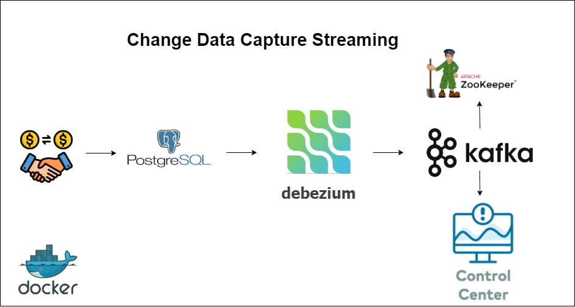
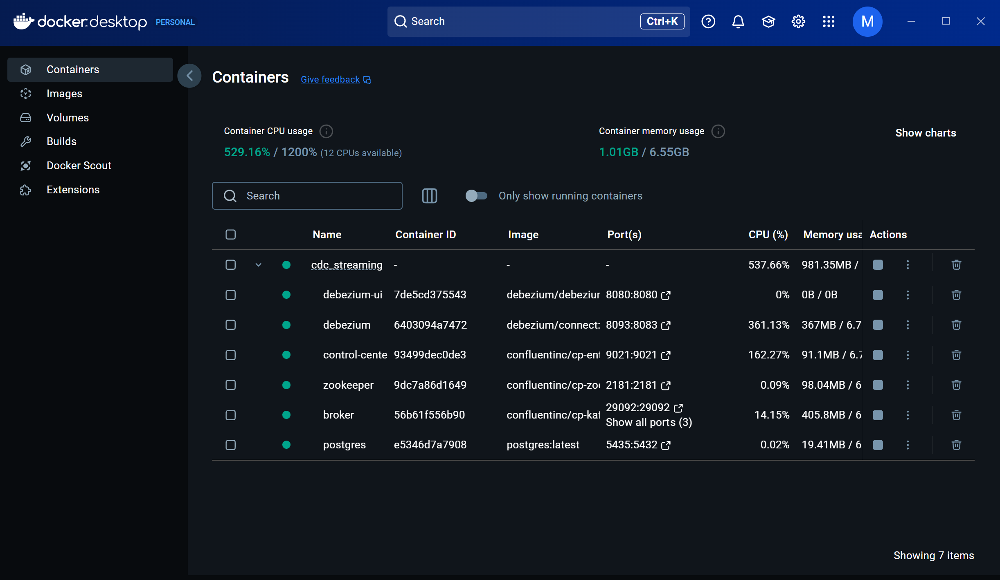
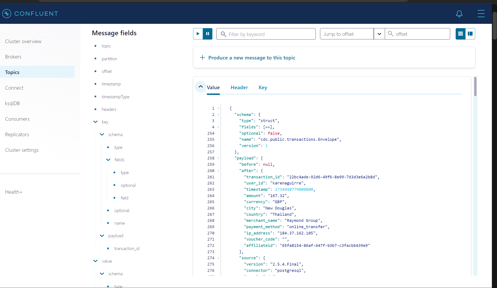
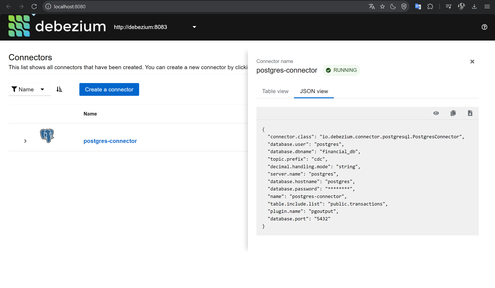

# Change Data Capture Streaming Project with Debezium, Kafka, Postgres, Docker

A real-time Change Data Capture (CDC) streaming project that captures database changes from PostgreSQL and streams them to Apache Kafka using Debezium.

## Overview

This project demonstrates the implementation of a Change Data Capture (CDC) system using Debezium, Kafka, Postgres, and Docker. The system generates simulated financial transactions using a Python script and inserts them into a PostgreSQL database. It is particularly useful for setting up a test environment for CDC with Debezium. The script uses the faker library to create realistic yet fictitious transaction data.

## Architecture

The project uses the following components:

<p align="center">
  
</p>

- Apache Kafka
- Apache ZooKeeper
- Debezium Connect
- Debezium UI
- PostgreSQL
- Confluent Control Center

## Repository Structure

The repository has the following structure:

```
cdc-streaming/
├── docker-compose.yml
├── README.md
├── requirements.txt
├── images/
│   ├── architecture.png
│   ├── control_center.png
│   ├── debezium_connector.png
│   └── docker.png
├── scripts/
│   └── generate_transactions.py
└── src/
  ├── kafka/
  ├── postgres/
  └── debezium/
```

## Prerequisites

- Docker and Docker Compose
- Python 3.x
- Required Python packages (see `requirements.txt`):
  - Faker
  - psycopg2-binary
  - python-dateutil
  - six

## Setup & Installation

1. Clone the repository:

```bash
git clone https://github.com/nits302/Change-Data-Capture-Streaming.git
cd cdc-streaming
```

2. Create and activate a virtual environment:

```bash
python -m venv venv
source venv/bin/activate  # Linux/Mac
.\venv\Scripts\activate   # Windows
```

3. Install dependencies:

```bash
pip install -r requirements.txt
```

4. Start the infrastructure using Docker Compose:

```bash
docker-compose up -d
```

Check containers in docker desktop:

<p align="center">
  
</p>

5 - Access to `control center UI` monitor Topic health, Procuder and consumer performance, Offset, Cluster health: `localhost:9021`

<p align="center">
  
</p>

6 - Debezium: `localhost:8080`

<p align="center">
  
</p>

## Services

The following services will be available:

| Service                  | URL                   | Description                   |
| ------------------------ | --------------------- | ----------------------------- |
| Kafka Broker             | localhost:9092        | Apache Kafka broker           |
| Confluent Control Center | http://localhost:9021 | Kafka management UI           |
| Debezium Connect         | http://localhost:8093 | Debezium Connect REST API     |
| Debezium UI              | http://localhost:8080 | Debezium management interface |
| PostgreSQL               | localhost:5435        | PostgreSQL database           |

## Configuration

The project uses the following default configurations (from docker-compose.yml):

- PostgreSQL:

  - Database: financial_db
  - Username: postgres
  - Password: postgres
  - Port: 5435

- Kafka:
  - Bootstrap servers: localhost:9092
  - External access: localhost:29092
  - Internal access: broker:29092

## 🚀 Video DEMO

[Demo Project Change Data Capture Streaming](https://youtu.be/pfwxqGCbFBY)

<b> ⚡️That's all for my project, thanks for watching. If you have any question, don't hesitate inbox me.⚡️</b>
